# Agent Identity

## Overview

Agent identity introduces **Agent** as a first-class entity in Jentic Mini. Today, agent identity is implicit — a `tk_xxx` key maps directly to a toolkit, and there is no durable concept of "which agent is calling." This changes that: an **agent** is a named, registered identity with its own credentials (keypair), lifecycle, and audit trail. Toolkits become resources that agents are **granted access to**, rather than the identity boundary itself.

Registration is **agent-initiated**: the agent introduces itself to Jentic Mini and submits its public key. A human admin then approves (or denies) the registration before the agent can obtain tokens. The keypair is generated **client-side** — Jentic Mini never sees or stores the private key.

The recommended deployment keeps the private key **outside** the agent's runtime environment. A sidecar or proxy holds the key, handles the token lifecycle, and injects the access token into the agent's requests — the agent never sees the signing key. For fully locked-down environments where Jentic Mini is not internet-reachable, it is acceptable (but not recommended) to place the keypair inside the agent's container.

---

## Concepts

| Term | Description |
|------|-------------|
| **Agent** | A first-class entity representing a distinct AI agent or agent instance. Has a name, credentials (a signing key), and grants to one or more toolkits. Registration is agent-initiated and human-approved. |
| **Signing key** | A single asymmetric keypair (Ed25519) bound to an agent. The public key is registered with Jentic Mini as a JWKS during DCR; the private key is generated and held client-side. One signing key per agent. |
| **Client assertion** | A short-lived JWT signed by the private key, sent to the token endpoint per RFC 7523. |
| **Access token** | A short-lived token issued by Jentic Mini per RFC 7523 / 6749. Used in `Authorization: Bearer <token>` on all subsequent requests. |
| **Refresh token** | A longer-lived, single-use token per RFC 6749 §6. Rotation: each use issues a new pair. |
| **Toolkit grant** | An explicit binding between an agent and a toolkit. An agent can only use credentials from toolkits it has been granted. |

---

## OAuth standards conformance

The entire agent identity flow is built from standard OAuth 2.0 RFCs. The only addition is a server-side admin approval policy between registration and token issuance — permitted by the RFCs but not defined by them.

| Step | Standard | Notes |
|------|----------|-------|
| Endpoint discovery | RFC 8414 (Authorization Server Metadata) | `GET /.well-known/oauth-authorization-server` returns `registration_endpoint`, `token_endpoint`, and server capabilities. Agents discover all endpoints from this document. |
| Agent registration | RFC 7591 (Dynamic Client Registration) | Agent `POST`s to the `registration_endpoint` with `client_name` + `jwks`. Server overrides `grant_types` and `token_endpoint_auth_method` defaults (permitted by §2). |
| Registration management + key rotation | RFC 7592 (DCR Management) | `GET` to read registration status on the `registration_client_uri` returned during registration. Authenticated by a short-lived `registration_access_token` (15 min default). Key rotation (JWKS update) requires human authentication via the admin API, not agent tokens. |
| Human approval | No RFC equivalent | Server-side policy. The token endpoint rejects grants for unapproved agents with `invalid_grant` (RFC 6749 §5.2). This does not make the flow non-OAuth-compliant — the RFCs permit the server to reject grants for any policy reason; admin approval is one such reason. |
| Token minting | RFC 7523 (JWT Bearer Grant) built on RFC 7521 (Assertion Framework) | Assertion signed with Ed25519 private key, validated against registered JWKS. |
| Bearer token usage | RFC 6750 | Standard `Authorization: Bearer` header. |
| Token refresh | RFC 6749 §6 | Refresh token rotation per OAuth Security BCP §4.14. |
| Token revocation | RFC 7009 | Standard `POST /oauth/revoke` with `token_type_hint`. |

### Server-side DCR defaults

RFC 7591 §2 defines default values for optional registration fields: `grant_types` defaults to `["authorization_code"]` and `token_endpoint_auth_method` defaults to `"client_secret_basic"`. Neither applies to the agent identity flow. The RFC permits the server to override client-supplied or default metadata, so Jentic Mini forces:

- `grant_types`: `["urn:ietf:params:oauth:grant-type:jwt-bearer"]`
- `token_endpoint_auth_method`: `"private_key_jwt"`

These are set server-side regardless of what the agent sends in the registration request, and returned in the registration response. Agents do not need to know or supply these values.

---

## Flow

```mermaid
sequenceDiagram
    participant Agent as Agent / Sidecar
    participant JM as Jentic Mini
    participant Human as Human Admin

    Note over Agent: Generate Ed25519 keypair locally

    rect rgb(40, 40, 60)
        Note right of Agent: RFC 8414 — Discovery
        Agent->>JM: GET /.well-known/oauth-authorization-server
        JM-->>Agent: 200 {registration_endpoint, token_endpoint, ...}
    end

    rect rgb(40, 40, 60)
        Note right of Agent: RFC 7591 — Dynamic Client Registration
        Agent->>JM: POST /register {client_name, jwks}
        JM-->>Agent: 201 {client_id, registration_access_token, registration_client_uri, status: pending}
    end

    rect rgb(40, 60, 40)
        Note right of Agent: RFC 7592 — Registration Management
        Agent->>JM: GET /register/{client_id} (Bearer rat_...)
        JM-->>Agent: 200 {status: pending}
    end

    rect rgb(80, 40, 40)
        Note right of Human: Admin policy (no RFC equivalent)
        Human->>JM: POST /agents/{id}/approve
        Human->>JM: POST /agents/{id}/grants {toolkit_id}
    end

    rect rgb(40, 40, 60)
        Note right of Agent: RFC 7523 — JWT Bearer Grant
        Note over Agent: Sign assertion JWT with private key
        Agent->>JM: POST /oauth/token (grant_type=jwt-bearer, assertion=...)
        JM-->>Agent: 200 {access_token, refresh_token, expires_in}
    end

    rect rgb(40, 60, 40)
        Note right of Agent: RFC 6750 — Bearer Token Usage
        Agent->>JM: GET /search?q=... (Bearer at_...)
        JM-->>Agent: 200 results
    end

    rect rgb(40, 40, 60)
        Note right of Agent: RFC 6749 §6 — Refresh Grant
        Agent->>JM: POST /oauth/token (grant_type=refresh_token)
        JM-->>Agent: 200 {access_token, refresh_token}
    end
```



---

## Data model

```
Agent (client_id, client_name, status, jwks, registration_client_uri, created_at, approved_at, approved_by, disabled_at)
  ├── Tokens (access + refresh, minted via RFC 7523 assertion)
  └── Toolkit Grants (client_id → toolkit_id, granted_at, granted_by)
```

- An **agent** registers itself via DCR and starts in `pending` status.
- A **human** approves or denies the registration. Only approved agents can obtain tokens.
- Each agent has exactly **one signing key** (its JWKS with a single public key).
- **Disabling** an agent invalidates all its tokens and prevents new token minting. The agent record and its grants are preserved for audit. Re-enabling restores access.
- **Toolkit grants** control which toolkits (and therefore which credentials) an agent can use.
- An agent with zero toolkit grants can authenticate but cannot access any credentials or broker any requests.

### Relationship to existing toolkit model

Toolkits remain the **credential and policy boundary** — they hold credential bindings, access policies, and IP restrictions. What changes is that a toolkit is no longer the agent's identity; it is a resource the agent is authorised to use. A single agent can be granted multiple toolkits. A single toolkit can be granted to multiple agents.

---

## Security model

### Recommended: keypair outside the agent

```
┌─────────────┐         ┌───────────────────┐         ┌─────────────┐
│   Agent      │──req──▶│  Sidecar / Proxy   │──req──▶│ Jentic Mini │
│  (no keys)   │        │  holds private key  │        │             │
│              │◀─resp──│  injects Bearer     │◀─resp──│             │
└─────────────┘         └───────────────────┘         └─────────────┘
```

- The agent issues plain requests; the sidecar intercepts and attaches the current access token.
- The sidecar handles assertion signing, token refresh, and token caching.
- A compromised agent process cannot exfiltrate the signing key.

### Acceptable: keypair inside the agent

Only when **all** of the following hold:

1. Jentic Mini is not reachable from the public internet.
2. The agent's container/VM is on a trusted private network.
3. The private key file is mounted read-only with restrictive permissions.

Even in this mode, access tokens are short-lived — a leaked token is time-bounded.

### Rate limiting (operator responsibility)

The unauthenticated endpoints `POST /register` and `POST /oauth/token` perform real work (signature generation, Ed25519 verification, DB writes) and are exposed to anonymous callers. Jentic Mini does **not** ship an in-process rate limiter — operators running an internet-facing instance should rate-limit these two endpoints (and ideally `GET /register/{client_id}`) at their reverse proxy or API gateway.

---

## API surface

### Discovery (RFC 8414)

```
GET    /.well-known/oauth-authorization-server  — returns server metadata including registration_endpoint, token_endpoint
```

### Agent registration (unauthenticated — agent-initiated, RFC 7591)

```
POST   /register                                — DCR: agent submits client_name + jwks → pending
```

### Registration status (registration_access_token, RFC 7592)

```
GET    /register/{client_id}                    — read own registration (status, metadata)
```

### Agent management (human session required)

```
GET    /agents                                  — list agents (`view=active|declined|removed`; optional `status` when active)
GET    /agents/{agent_id}                       — agent detail
POST   /agents/{agent_id}/approve               — approve a pending registration
POST   /agents/{agent_id}/deny                  — decline pending registration (strips JWKS, grants, tokens, registration token)
POST   /agents/{agent_id}/disable               — disable agent (invalidates tokens, blocks new minting)
POST   /agents/{agent_id}/enable                — re-enable a disabled agent
PUT    /agents/{agent_id}/jwks                  — rotate agent's signing key (replace JWKS)
DELETE /agents/{agent_id}                       — deregister (soft archive: clears JWKS, grants, tokens, registration secrets; row kept read-only)
```

### Toolkit grants (human session required)

```
POST   /agents/{agent_id}/grants                — grant agent access to a toolkit
GET    /agents/{agent_id}/grants                — list toolkit grants
DELETE /agents/{agent_id}/grants/{toolkit_id}   — revoke toolkit access
```

### Token lifecycle (RFC 7523 / 6749 / 7009)

```
POST   /oauth/token                             — mint (JWT bearer assertion) or refresh (refresh_token grant)
POST   /oauth/revoke                            — revoke a token (RFC 7009)
```

---

## Lifecycle detail

### 0. Endpoint discovery (RFC 8414)

The agent discovers all OAuth endpoints from the well-known metadata document.

```
GET /.well-known/oauth-authorization-server

→ 200 OK
{
  "issuer": "https://mini.example.com",
  "registration_endpoint": "https://mini.example.com/register",
  "token_endpoint": "https://mini.example.com/oauth/token",
  "revocation_endpoint": "https://mini.example.com/oauth/revoke",
  "grant_types_supported": ["urn:ietf:params:oauth:grant-type:jwt-bearer", "refresh_token"],
  "token_endpoint_auth_methods_supported": ["private_key_jwt"],
  "token_endpoint_auth_signing_alg_values_supported": ["EdDSA"],
  "response_types_supported": ["none"]
}
```

### 1. Agent registers itself (RFC 7591)

The agent generates an Ed25519 keypair client-side and submits the public key as a JWKS to the `registration_endpoint` discovered above.

```
POST /register
Content-Type: application/json

{
  "client_name": "research-agent",
  "jwks": {
    "keys": [{
      "kty": "OKP",
      "crv": "Ed25519",
      "x": "<base64url public key>"
    }]
  }
}

→ 201 Created
{
  "client_id": "agnt_...",
  "client_name": "research-agent",
  "registration_access_token": "rat_...",
  "registration_client_uri": "https://mini.example.com/register/agnt_...",
  "grant_types": ["urn:ietf:params:oauth:grant-type:jwt-bearer"],
  "token_endpoint_auth_method": "private_key_jwt",
  "jwks": { ... },
  "status": "pending"
}
```

- `grant_types` and `token_endpoint_auth_method` are set server-side (see [Server-side DCR defaults](#server-side-dcr-defaults)).
- `registration_client_uri` is the RFC 7592 client configuration endpoint for this agent. Only `GET` (read) is implemented and advertised in the OpenAPI spec — `PUT` and `DELETE` are not exposed to clients and return 403 (`operation_not_supported`) if called directly. See [Why not agent-initiated rotation?](#why-not-agent-initiated-rotation) for the rationale and the human-administered alternatives (`PUT /agents/{client_id}/jwks`, `DELETE /agents/{client_id}`).
- `status` is a non-standard extension field indicating the approval state (`pending`, `active`, `disabled`). RFC 7591 §2 and §3.2.1 permit the server to include additional metadata values in the registration response; standard DCR clients that don't recognise the field will simply ignore it. The same field is also returned by `GET /register/{client_id}` and is what agents poll on while awaiting human approval (see [Agent polls status](#2-agent-polls-status-rfc-7592)).
- `registration_access_token` is scoped to the `registration_client_uri` only (RFC 7592) and short-lived (15 minutes by default — see [Key rotation security note](#security-note-the-registration_access_token-is-a-sensitive-credential)).
- **Note:** for internet-facing deployments, rate-limit this endpoint at your reverse proxy — see [Rate limiting](#rate-limiting-operator-responsibility).

### 2. Agent polls status (RFC 7592)

```
GET /register/agnt_...
Authorization: Bearer rat_...

→ 200 OK
{
  "client_id": "agnt_...",
  "client_name": "research-agent",
  "jwks": { ... },
  "grant_types": ["urn:ietf:params:oauth:grant-type:jwt-bearer"],
  "token_endpoint_auth_method": "private_key_jwt",
  "registration_access_token": "rat_...",
  "registration_client_uri": "https://mini.example.com/register/agnt_...",
  "status": "pending"
}
```

### 3. Human approves and grants toolkits

```
POST /agents/agnt_.../approve
Authorization: <human session cookie>

POST /agents/agnt_.../grants
Authorization: <human session cookie>
Content-Type: application/json

{ "toolkit_id": "my-toolkit" }
```

### 4. Token minting (RFC 7523)

```
POST /oauth/token
Content-Type: application/x-www-form-urlencoded

grant_type=urn:ietf:params:oauth:grant-type:jwt-bearer
&assertion=<signed JWT>
```

**Assertion JWT claims:**

| Claim | Value |
|-------|-------|
| `iss` | `client_id` (`agnt_...`) |
| `aud` | Jentic Mini token endpoint URL |
| `iat` | Current timestamp |
| `exp` | Short-lived (≤ 5 minutes) |
| `jti` | Unique nonce (replay protection) |

**Validation:**

1. Look up the agent by `iss` → retrieve JWKS.
2. Verify agent status is `approved` (reject with `invalid_grant` per RFC 6749 §5.2 otherwise).
3. Verify JWT signature (EdDSA) against the registered public key.
4. Check `exp`, `aud`, `jti` (reject replayed nonces within a window).

**Response:**

```json
{
  "access_token": "at_...",
  "token_type": "Bearer",
  "expires_in": 3600,
  "refresh_token": "rt_..."
}
```

- **Access token** — 1 hour TTL (configurable).
- **Refresh token** — 7 day TTL (configurable). Single-use; rotation per OAuth Security BCP §4.14.

### 5. Using the access token (RFC 6750)

```
GET /search?q=send+email
Authorization: Bearer at_...
```

The auth middleware resolves `at_...` → agent → granted toolkits → credentials. `request.state.agent_id` is set alongside `request.state.toolkit_id` (resolved from grants). Expired tokens return `401` with a `WWW-Authenticate` header.

When an agent has multiple toolkit grants, the broker selects the credential by matching the upstream host against the granted toolkits' credential bindings.

### 6. Token refresh (RFC 6749 §6)

```
POST /oauth/token
Content-Type: application/x-www-form-urlencoded

grant_type=refresh_token
&refresh_token=rt_...
```

- Returns a new access + refresh token pair.
- The consumed refresh token is immediately invalidated (rotation).
- If expired or already consumed, re-authenticate with a new assertion.
- **Reuse-detection (RFC 6749 Security BCP §4.14):** presenting an already-consumed refresh token signals a likely chain compromise. Jentic Mini walks the rotation chain via `parent_token_hash` and revokes the entire token family (all access and refresh tokens descending from the same root assertion) in one shot, so neither the legitimate holder nor an attacker can keep rotating. The agent must re-authenticate with a fresh JWT-bearer assertion.

### 7. Disabling an agent

```
POST /agents/agnt_.../disable
Authorization: <human session cookie>
```

- All active access and refresh tokens are immediately invalidated.
- New assertion-based token requests are rejected.
- The agent record and toolkit grants are preserved.
- Re-enabling (`POST /agents/{id}/enable`) restores the ability to mint tokens without re-registration or re-granting.

### 8. Token revocation (RFC 7009)

```
POST /oauth/revoke
Authorization: Bearer at_...
Content-Type: application/x-www-form-urlencoded

token=at_...
&token_type_hint=access_token
```

Revocation requires authentication — either an agent access token (`at_…`) or a human session.

Disabling or deleting the agent also cascades to all tokens.

---

## Key rotation (RFC 7592)

Key rotation — replacing the agent's registered public key — is a high-privilege operation. A compromised key rotation mechanism allows full identity takeover. For this reason, **key rotation requires human authentication** (admin session), not agent-held tokens.

### Flow

1. The operator (or automated tooling with human credentials) generates a new Ed25519 keypair.
2. The operator submits the new JWKS via the admin API:

```
PUT /agents/{agent_id}/jwks
Authorization: <human session cookie>
Content-Type: application/json

{
  "jwks": {
    "keys": [{
      "kty": "OKP",
      "crv": "Ed25519",
      "x": "<new base64url public key>"
    }]
  }
}
```

3. The new public key takes effect immediately. Existing access/refresh tokens remain valid until they expire or the agent is disabled.
4. The new private key is deployed to the agent's environment (sidecar, container, etc.).

### Why not agent-initiated rotation?

RFC 7592 permits agents to update their own registration via `PUT /register/{client_id}` (and self-deregister via `DELETE`). Jentic Mini intentionally does **not** implement these — the routes are excluded from the OpenAPI spec and Swagger UI, and any direct call returns `403 operation_not_supported` (RFC 7592 §1 explicitly allows this: "the authorization server MAY return an HTTP 403 (Forbidden) error code if a particular action is not supported"). Allowing agents to rotate their own keys creates risk:

- A compromised agent token (even short-lived) could be used to swap in an attacker's public key.
- The `identity:rotate` scope approach adds complexity and still relies on token security.
- Key rotation is infrequent enough that requiring human involvement is not burdensome.

This may be revisited if automated key rotation becomes a common operational requirement, but for now the conservative approach is preferred.

### The registration_access_token

The `registration_access_token` returned during DCR is short-lived (15 minutes by default) and scoped only to reading registration status — it cannot update the JWKS. This covers the bootstrap window where the agent polls for approval. After the window expires, the token is no longer usable.

---

## Database changes

| Table | Purpose |
|-------|---------|
| `agents` | `client_id`, `client_name`, `status` (pending/approved/denied/disabled), `jwks`, `registration_token_hash`, `registration_client_uri`, `created_at`, `approved_at`, `approved_by`, `disabled_at` |
| `agent_toolkit_grants` | `client_id`, `toolkit_id`, `granted_at`, `granted_by` |
| `agent_tokens` | `token_hash`, `client_id`, `token_type` (access/refresh), `expires_at`, `consumed_at`, `parent_token_hash` |
| `agent_nonces` | `jti`, `client_id`, `expires_at` (short-lived replay window, prunable) |

Alembic migration(s) add these tables. Existing `toolkit_keys` table is unchanged — `tk_xxx` keys continue to work.

The signing key (JWKS) lives directly on the `agents` row since there is exactly one per agent.

---

## Coexistence with `tk_xxx` keys

Static API keys remain supported — agent identity is opt-in. The auth middleware checks:

1. `X-Jentic-API-Key: tk_xxx` → existing key-based lookup (toolkit-scoped, no agent identity).
2. `Authorization: Bearer at_...` → agent token lookup (agent-scoped, toolkit(s) via grants).

No migration required. Toolkits that only use static keys are unaffected.

**Non-breaking change:** These architecture changes are fully backward-compatible. Agents using the existing toolkit API key flow (`X-Jentic-API-Key: tk_xxx`) continue to work exactly as before with no code changes required. Agent identity is an additional authentication option for agents using the legacy flow, but the standard pattern for any future agents.

---

## Configuration

| Env var | Default | Purpose |
|---------|---------|---------|
| `AGENT_ACCESS_TTL` | `3600` | Access token lifetime (seconds) |
| `AGENT_REFRESH_TTL` | `604800` | Refresh token lifetime (seconds) |
| `AGENT_REGISTRATION_TOKEN_TTL` | `900` | Registration access token lifetime (seconds) — bootstrap window only |
| `AGENT_ASSERTION_MAX_AGE` | `300` | Max age of assertion JWT (seconds) |
| `AGENT_NONCE_WINDOW` | `600` | JTI replay detection window (seconds) |

**Note:** `AGENT_NONCE_WINDOW` must be greater than `AGENT_ASSERTION_MAX_AGE` to ensure there is no gap where a replayed assertion could slip through after its `jti` has been pruned but before the assertion itself has expired.

---

## Agent self-service requests

> **Note:** This section describes a **provisional design** that is **not yet implemented**. The API surface and request types are subject to change. Implementation is planned for future feature work.

Authenticated agents can request additional capabilities at runtime, following the same access-request-plus-approval pattern used today for toolkit-level credential access. All such requests require **human approval** before they take effect.

Supported request types:

| Type | Purpose |
|------|---------|
| `grant_toolkit` | Request that the agent be granted access to an existing toolkit. |
| `create_toolkit` | Request that a new toolkit be created (with a proposed name, description, and optional initial credentials). |
| `modify_permissions` | Request fine-grained allow/deny rule changes on a toolkit the agent already has access to (reuses the existing mechanism). |
| `add_credential` | Request that a credential be added to a toolkit the agent has access to (payload references an existing credential record; credential values are never handled by the agent). |
| `grant_credential` | Request that a specific credential be bound to an accessible toolkit for the agent. |

The existing `/toolkits/{toolkit_id}/access-requests` endpoint remains for toolkit-scoped requests (e.g. `modify_permissions`, `grant_credential`) where a toolkit context already exists. Agent-scoped requests that are not tied to a specific toolkit (e.g. `create_toolkit`, `grant_toolkit` for a toolkit the agent has no current access to) live under the agent:

```
POST   /agents/me/requests                     — agent submits a request
GET    /agents/me/requests                     — agent lists own requests
GET    /agents/{agent_id}/requests             — human session: list requests by agent
POST   /agents/{agent_id}/requests/{req_id}/approve   — human approves
POST   /agents/{agent_id}/requests/{req_id}/deny      — human denies
```

Every request carries:

- `type` — one of the request types above
- `reason` — free-text justification shown to the approver
- `payload` — type-specific fields (toolkit name, credential reference, rules, etc.)
- `agent_id` — derived from the authenticated access token, not from the request body

On approval the request is applied idempotently (creating the toolkit, adding the grant, binding the credential, etc.). The agent should poll its request via `GET /agents/me/requests/{req_id}` until the status is `approved` or `denied`; it then retries the original operation. All actions taken on approval are written to the trace log with both `agent_id` and `approved_by` recorded, so the audit trail makes clear which agent triggered a change and which human authorised it.

---

## Traces and audit

Every request authenticated by an agent access token records the resolved `agent_id` on the trace in addition to the `toolkit_id` selected for credential injection. This gives admins a full "which agent did what through which toolkit" view. Requests authenticated by toolkit `tk_xxx` keys (without an agent access token) continue to record only `toolkit_id` (no agent identity).

Human-initiated actions on agent-owned resources (approving a registration, approving a self-service request, disabling an agent, granting a toolkit) are also recorded on the trace with the human user's identity as `approved_by` or `acted_by`, so policy changes are auditable end-to-end.

### Read-side scoping on `GET /traces` and `GET /traces/{id}`

Trace reads are scoped to the calling principal:

- **Human session (admin):** sees all traces.
- **Agent OAuth caller (`at_…`):** sees only traces stamped with its own `agent_id`.
- **Toolkit-key caller (`tk_xxx`):** sees every trace tagged with the bound toolkit, regardless of which agent (or no agent) produced it. This is intentional — it preserves visibility for legacy / unregistered agents that call via a toolkit key and would otherwise have no `agent_id` to filter by, and it treats the toolkit-key holder as the operator of that toolkit.

**Security note.** The blessed pattern is per-agent OAuth identity. Handing a long-lived `tk_xxx` key to a registered agent therefore upgrades that agent from "see only my own traces" to "see every trace from every agent that shares this toolkit". Treat toolkit keys as operator credentials, not agent credentials.

---

## Decisions

### Token format: opaque with DB lookup

Access and refresh tokens use opaque format (`at_...`, `rt_...`) stored hashed in the database, consistent with the existing `tk_xxx` key pattern.

**Rationale:**

- **Simplicity** — single token validation path, no JWT parsing/verification logic for access tokens (assertion JWTs are already handled separately for the grant flow).
- **Consistency** — matches the existing `tk_xxx` key model; operators familiar with one understand the other.
- **Revocation** — immediate revocation by deleting/marking the token row. JWTs require either short TTLs (more refresh traffic) or a revocation list (negates the stateless benefit).
- **Size** — opaque tokens are ~40 bytes; JWTs with claims are 300+ bytes. Matters for high-frequency agent traffic.
- **Security posture** — no claims exposed to the agent. The agent learns nothing about its grants, scopes, or expiry from the token itself — all policy is server-side.

The DB round-trip cost is acceptable: Jentic Mini is not a high-scale edge proxy, and the token lookup is a single indexed query. If latency becomes a concern, a short-lived in-memory cache (e.g. 60s TTL) can be added without changing the token format.

---

## Design notes

### Agent–environment relationship

There is currently an implicit 1:1 relationship between an agent identity and the environment (container, VM, sidecar) that holds its private key. A single signing key is registered per agent, so only one environment can authenticate as that agent at any given time.

This means:

- **No parallel multi-environment for one agent** — you cannot have three agent containers all authenticating as "research-agent" simultaneously, because they would need to share the same private key (a security anti-pattern) or each hold a different key (but only one key is registered per agent).

This is the correct pattern for the vast majority of use cases — each running instance should have its own identity for auditability. If it becomes common for users to need the same logical agent authenticated from multiple environments in parallel, the model could be extended: an abstract "agent" entity at a higher level, with multiple "clients" (each with its own keypair) associated with it. For now, agent = client = single environment.

### Scopes

Scopes are not yet implemented for agent tokens. When scopes are added to the authentication system at large, agent identity tokens will support them — allowing fine-grained permission control (e.g. read-only access, execute access etc.). For now, an agent's capabilities are determined entirely by its toolkit grants.

### Nonce table pruning

The JWT-bearer replay cache (`agent_nonces`) is pruned on every successful assertion via `DELETE FROM agent_nonces WHERE expires_at < ?`. This is fine at expected volumes but is a write amplifier on the hot path under load. A future pass should move this to a periodic background sweep (or a small-table fast-path that skips the prune when the row count is below a threshold). Tracked for follow-up work.

---

## Open questions

1. **Sidecar reference implementation** — should Jentic Mini ship a minimal sidecar container image, or just document the protocol for third-party proxies?
2. **Multi-toolkit resolution** — *Decision (interim):* when an agent has grants to multiple toolkits with credentials for the same upstream host, the broker returns `409 CREDENTIAL_AMBIGUOUS` and the caller disambiguates with `X-Jentic-Credential` or `X-Jentic-Service`. Longer-term precedence semantics (e.g. agent-level defaults, per-grant priority) will be designed and implemented in future feature work.
3. **MTLS alternative** — for environments that support it, mutual TLS with client certificates could replace the assertion flow. Worth supporting as a second auth method?
